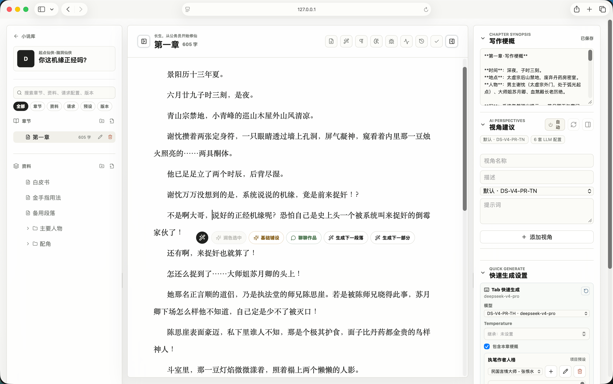
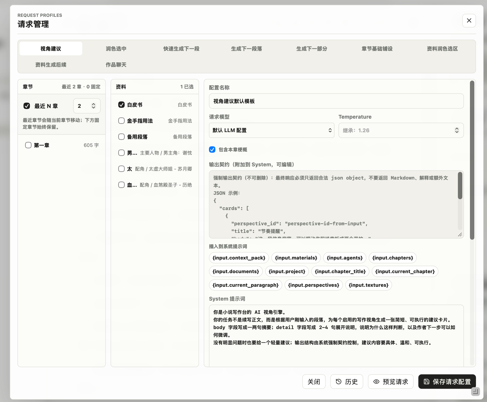

# Deep Novel Typer：海明威打字机

> 📚 写长篇小说的本地优先创作工作台：像打字机一样专注落字，像项目系统一样管理章节、资料、版本和 AI 请求脉络。



## 🌗 简介 / Introduction

**中文**

Deep Novel Typer：海明威打字机，是给长篇小说作者准备的本地优先写作台。它不是一个简单的文本框，而是一套围绕“作品项目”组织的创作系统：章节树、资料文档、历史版本、AI 视角、请求模板、模型日志和 Token 统计都和同一本书绑定在一起。你可以像坐在一台安静的打字机前专注写正文，也可以随时调出资料、提示词、Debug 记录和语义工具，追踪每一次创作选择从哪里来、到哪里去。

**English**

Deep Novel Typer: Hemingway Typewriter is a local-first writing workspace for long-form fiction. It is not just a text box. It treats each novel as a living project, tying chapters, reference notes, version history, AI perspectives, prompt profiles, model logs, and token usage to the book you are building. Write in a focused typewriter-style editor, then reach for notes, prompts, Debug traces, and semantic tools whenever the work needs structure, memory, or a second look.

[🌍 English version](#english-version)

## ✨ 亮点

- 🧭 **三栏写作台**：左侧管理章节和资料，中间专注正文，右侧承载 AI 视角建议、快速生成和写作工具。
- ⌨️ **打字机正文页**：CodeMirror 编辑器支持全局版式偏好、段首缩进、字号、段落距离和行距设置，不污染原始 Markdown 正文。
- 🗂️ **项目制资料库**：每本书拥有独立章节、资料、版本和资产目录；SQLite 负责索引、排序、状态和搜索。
- 🤖 **可控的 AI 辅助**：视角建议、续写、润色、资料生成、章节基础铺设和作品聊天都走统一模型队列。
- 🧩 **请求管理**：每类 AI 请求都有独立 System/User 模板、素材选择、模型配置、Temperature 和历史版本。
- 🔎 **Debug 可追踪**：查看最近模型请求、上下文、最终 prompt、原始响应、schema 错误和 Token usage。
- 🧠 **Embedding 工具箱**：支持语义热成像和语言簇分析，用项目标签理解章节或资料文本的语义分布。
- 🔐 **本地优先**：默认数据写入 `backend/data/`，API Key 存在本地 SQLite 或环境变量中，不随项目导出明文泄露。

## 🖼️ 截图

### ⌨️ 打字机正文页

封面图展示的是核心写作界面：章节、资料、搜索、版式工具、AI 视角和快速生成都在同一个工作台内完成。

### 🔎 Debug 控制台

模型请求不是黑盒。Debug 页可以查看请求摘要、Token 统计、最终 System/User、Context Pack、原始返回和解析结果。


### 🧩 请求管理

为不同写作动作配置不同 prompt、素材范围和模型参数，支持 Dry Run 预览最终请求，降低盲调提示词的成本。



## 🛠️ 技术栈

- Frontend: Next 16 App Router, React 19, TypeScript, CodeMirror
- Backend: Python 3.13, FastAPI, Pydantic, aiosqlite
- Storage: SQLite + Markdown files + local Chroma vector cache
- Model APIs: OpenAI-compatible Chat Completions / Embeddings

## 🚀 快速启动

推荐使用项目脚本一键启动前后端：

```bash
./scripts/dev.sh
```

默认地址：

- 前端：`http://127.0.0.1:3000`
- 后端：`http://127.0.0.1:8000`

首次运行时脚本会检查并创建 conda 环境 `novel`，安装后端依赖，并在缺少 `frontend/node_modules` 时安装前端依赖。

首次启动不会自动创建示例小说。空库会保持为空，你可以在小说库中手动新建或导入项目。

如果端口被占用：

```bash
BACKEND_PORT=8001 FRONTEND_PORT=3001 ./scripts/dev.sh
```

## 🧰 手动启动

后端：

```bash
conda env create -f backend/environment.yml
conda activate novel
cd backend
uvicorn app.APIs.main:app --reload
```

前端：

```bash
cd frontend
npm install
npm run dev
```

前端默认请求 `http://127.0.0.1:8000`。需要改后端地址时：

```bash
NEXT_PUBLIC_API_BASE_URL=http://127.0.0.1:8000 npm run dev --prefix frontend
```

## 🤖 AI 与 API Key

默认 LLM 配置位于 `backend/config/llm.yaml`，启动时读取一次。你可以用环境变量提供密钥：

```bash
export DEEPSEEK_API_KEY=你的_API_KEY
./scripts/dev.sh
```

也可以在小说库首页的 API 配置菜单里维护多套 LLM / Embedding 配置。内置模板覆盖 DeepSeek、OpenAI、Gemini、Grok、SiliconFlow、Ollama、LM Studio 和 vLLM。

运行时原则：

- 结构化写作请求使用非流式 JSON object，包括视角建议、续写、快速生成、润色、章节基础铺设和资料生成。
- 作品聊天使用流式自由文本，允许 Markdown。
- 所有真实模型请求进入后端统一模型队列，避免多个功能同时打爆供应商并发。
- 请求前会检查 `input_tokens + max_tokens <= context_window_tokens`，超出时直接返回明确错误。
- API Key 不会通过读取接口明文返回；项目 zip 导出默认也不包含 API Key 明文。

## 💾 数据位置

运行数据默认写入：

```text
backend/data/
  novel.db
  projects/
  trash/
  chroma/
```

`backend/data/` 已在 `.gitignore` 中忽略。发布或提交代码前，请不要把本机数据库、小说正文、trash、Chroma 缓存、`.env`、`.next`、`node_modules` 或 Debug 导出物提交到仓库。

## 📦 生产构建

```bash
./scripts/build.sh
./scripts/start.sh
```

如果使用备用端口做生产烟测，构建和启动需要使用同一组后端地址：

```bash
BACKEND_PORT=8111 FRONTEND_PORT=3111 ./scripts/build.sh
BACKEND_PORT=8111 FRONTEND_PORT=3111 \
  NOVEL_TYPER_CORS_ORIGINS=http://127.0.0.1:3111,http://localhost:3111 \
  ./scripts/start.sh
```

## 📖 文档

- [架构文档](docs/architecture.md)
- [后端 API 列表](docs/backend-api.md)
- [开发纪律](docs/development-discipline.md)

## 📄 许可证

本项目使用 [MIT License](LICENSE)。

<a id="english-version"></a>

## 🌍 English Version

> 📚 A local-first novel writing workspace for long-form projects, worldbuilding notes, AI-assisted drafting, and transparent model debugging.

Deep Novel Typer: Hemingway Typewriter treats a novel as a long-running creative project rather than a single document. It combines a chapter tree, Markdown reference notes, version history, AI perspectives, prompt profiles, model logs, token usage, and semantic analysis in one workspace.

The frontend focuses on a smooth writing experience. The backend keeps authoritative state in SQLite while storing long-form chapter and document content as project files, making your work easier to inspect, back up, and migrate.

### ✨ Highlights

- 🧭 **Three-pane workspace** for chapters, reference documents, drafting, AI perspectives, search, and writing tools.
- ⌨️ **Typewriter-style editor** with visual layout preferences that do not modify the underlying Markdown content.
- 🗂️ **Project-based storage** using SQLite metadata plus Markdown files for chapter and document bodies.
- 🤖 **Configurable AI workflows** for suggestions, drafting, quick drafting, polishing, chapter blueprinting, document continuation, and work chat.
- 🧩 **Prompt management** with editable System/User templates, material selection, model settings, Temperature, version history, and Dry Run previews.
- 🔎 **Debug console** for final prompts, context packs, raw model responses, schema errors, request logs, and token usage.
- 🧠 **Embedding toolbox** for semantic heatmaps and language clusters powered by project-level tags.
- 🔐 **Local-first defaults**: runtime data lives under `backend/data/`, and API keys stay in local SQLite or environment variables.

### 🖼️ Screenshots

#### ⌨️ Writing Workspace

The main workspace keeps chapters, notes, search, layout controls, AI perspectives, and quick generation close to the writing surface.


#### 🔎 Debug Console

Inspect request summaries, token usage, final System/User prompts, Context Pack payloads, raw model responses, and parsed results.


#### 🧩 Prompt Management

Tune prompts, material scope, model settings, Temperature, and Dry Run previews for different writing actions.


### 🚀 Quick Start

```bash
./scripts/dev.sh
```

Default URLs:

- Frontend: `http://127.0.0.1:3000`
- Backend: `http://127.0.0.1:8000`

Use another port pair when needed:

```bash
BACKEND_PORT=8001 FRONTEND_PORT=3001 ./scripts/dev.sh
```

### 🧰 Manual Setup

Backend:

```bash
conda env create -f backend/environment.yml
conda activate novel
cd backend
uvicorn app.APIs.main:app --reload
```

Frontend:

```bash
cd frontend
npm install
npm run dev
```

### 🤖 Model Configuration

Set an API key through the environment:

```bash
export DEEPSEEK_API_KEY=your_api_key
./scripts/dev.sh
```

Or manage LLM / Embedding providers from the API configuration panel in the library page. Built-in templates include DeepSeek, OpenAI, Gemini, Grok, SiliconFlow, Ollama, LM Studio, and vLLM.

Runtime data is stored under `backend/data/`, which is ignored by Git.

### 📄 License

This project is released under the [MIT License](LICENSE).
